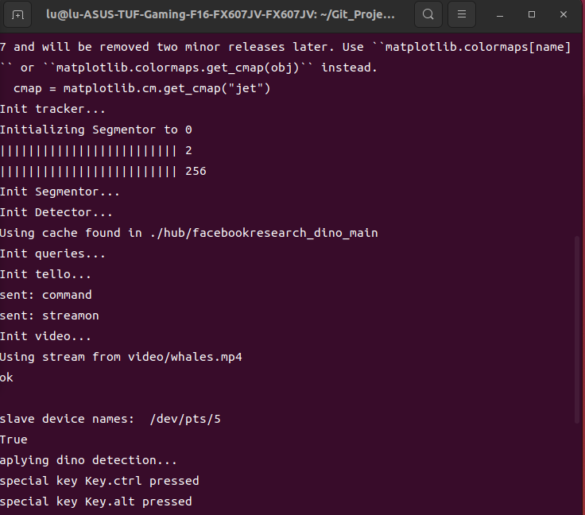

### 部署Follow-Anything

#### 1. 在本地部署Follow-Anything算法

1. https://github.com/alaamaalouf/FollowAnything?tab=readme-ov-file
2. 所有可用pip安装的包不存在直接下包即可
3. `import sam.segment_anything`找不到模块，将左语句修改为：

~~~python
sys.path.append("./Segment-and-Track-Anything/sam")
import segment_anything
~~~

2. Hugging face下载预训练文件https://huggingface.co/spaces/Schrodingers/gradio_deploy/tree/main/ckpt

3. 报错：`OMP: Error #15: Initializing libiomp5md.dll, but found libiomp5md.dll already initialized.`

   * [直接解决OMP: Error #15: Initializing libiomp5md.dll, but found libiomp5md.dll already initialized.报错问题_os.environ“kmp_duplicate_lib_ok”\]=“true”-CSDN博客](https://blog.csdn.net/Victor_X/article/details/110082033)

   * 将`libiomp5md.dll`文件名改成`libiompchange.dll`

4. `ERROR: Could not build wheels for spatial_correlation_sampler`

   * [踩坑之路——spatial_correlation_sampler的安装-CSDN博客](https://blog.csdn.net/weixin_41401924/article/details/124980942)

5. 利用已有的demo视频进行推演

~~~shell
python follow_anything.py  --desired_height 240 --desired_width 320 --path_to_video <PATH TO VIDEO> --save_images_to outputs/ --detect box --redetect_by box --tracker aot --plot_visualizations
~~~

6. 自己prompt

~~~shell
python annotate_features.py --desired_height 240 --desired_width 320 --queries_dir myquery
~~~

~~~shell
# prompt后运行
python follow_anything.py --desired_height 240 --desired_width 320 --path_to_video example_videos/brick_following.avi --save_images_to outputs/ --detect dino --use_sam --tracker aot --queries_dir myquery --desired_feature 1 --plot_visualizations
~~~

7. 仅用DINO的pipeline

~~~shell
python follow_anything.py --desired_height 240 --desired_width 320 --path_to_video example_videos/brick_following.avi --save_images_to outputs/ --detect dino --tracker aot --queries_dir queries/brick_following/ --desired_feature 7 --plot_visualizations --use_16bit --use_traced_model
~~~

8. Huggingface安装clip预训练权值

先在https://huggingface.co/laion/CLIP-ViT-B-32-laion2B-s34B-b79K/tree/main处下载文件`open_clip_pytorch_model.bin`

~~~shell
clip, _, clip_preprocess = open_clip.create_model_and_transforms('ViT-B-32', pretrained='./Segment-and-Track-Anything/ckpt/open_clip_pytorch_model.bin')
~~~

9. 用text prompt完成pipeline

~~~shell
python follow_anything.py --desired_height 240 --desired_width 320 --path_to_video example_videos/brick_following.avi --save_images_to outputs/ --detect clip --tracker aot  --desired_feature "a small brick on the ground" --text_query "a small brick on the ground" --plot_visualizations --use_sam
~~~

10.用无人机进行follow

```shell
python follow_anything.py --desired_height 240 --desired_width 320 --save_images_to outputs/ --detect dino --tracker aot --queries_dir myquery --desired_feature 20 --plot_visualizations --fly_drone --use_sam --use_yaw --use_datadrawer

```

11.分成了两套代码，一套用于tello，为follow_anything_tello.py，另一套用于mini3pro，为follow_anything_mini.py

12.添加了打印数据曲线的脚本

首先启动follow_anything，会自动生成虚拟串口并且print到终端上

```shell
python follow_anything_tello.py --desired_height 240 --desired_width 320 --save_images_to outputs/ --detect dino --tracker aot --queries_dir myquery --desired_feature 20 --plot_visualizations --fly_drone --use_sam --use_yaw --use_datadrawer
```



看到其中有slave device names的数据，把其中的路径复制，然后可以启动dataDrawer文件夹中的drawer.py，并且设置串口号和显示通道的数量（6个以内）

```shell
python drawer.py --serial_port /dev/pts/5 --channel_num 3 --plot_mode gather
```


#### 2. python tello视频流抓取

1. try1：opencv视频编解码（失败）
   1. openH264解码：[利用OpenCV进行H264视频编码的简易方式 - 知乎 (zhihu.com)](https://zhuanlan.zhihu.com/p/200783234)
   2. openH264.dll下载[Release Release version 1.7.0 · cisco/openh264 (github.com)](https://github.com/cisco/openh264/releases/tag/v1.7.0)


2. try2：利用ffmpeg提取视频流（失败）

   1. [Python3利用ffmpeg针对视频进行一些操作-腾讯云开发者社区-腾讯云 (tencent.com)](https://cloud.tencent.com/developer/article/2068011)
   2. [FFmpeg 在 Python 中的安装使用方法详解_ffpemg python-CSDN博客](https://blog.csdn.net/PY0312/article/details/105870120)

3. try3：尝试利用pyav解码视频流（失败）

   1. pyav解码h264,h265文件[python小工具------将H264/H265码流文件转为一帧一帧的JPEG文件_h265 python解码-CSDN博客](https://blog.csdn.net/baidu_41191295/article/details/124102833#:~:text=输入H264%2FH,保存到指定路径。)
   2. 测试264流文件[H264测试视频 - mcodec - 博客园 (cnblogs.com)](https://www.cnblogs.com/mcodec/articles/1619973.html#:~:text=简单的H264测试视频，128x128大小，供网友调试程序。,下载：http%3A%2F%2Ffiles.cnblogs.com%2Fmcodec%2F128x128.264.rar)

   3. 向python写入字节[用 Python 向文件写入字节 | D栈 - Delft Stack](https://www.delftstack.com/zh/howto/python/write-bytes-to-file-python/)

   4. str和bytes相互转换[python str与bytes之间的转换_python 如何把str转换为byte-CSDN博客](https://blog.csdn.net/yatere/article/details/6606316)

4. try4：
   1. [Windows下CMake安装教程_window 安装cmake-CSDN博客](https://blog.csdn.net/u011231598/article/details/80338941)

#### 3. 移植Efficient SAM
